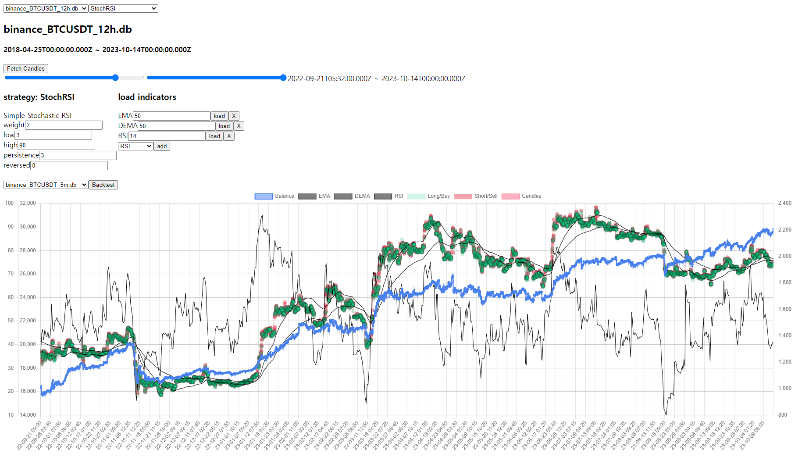
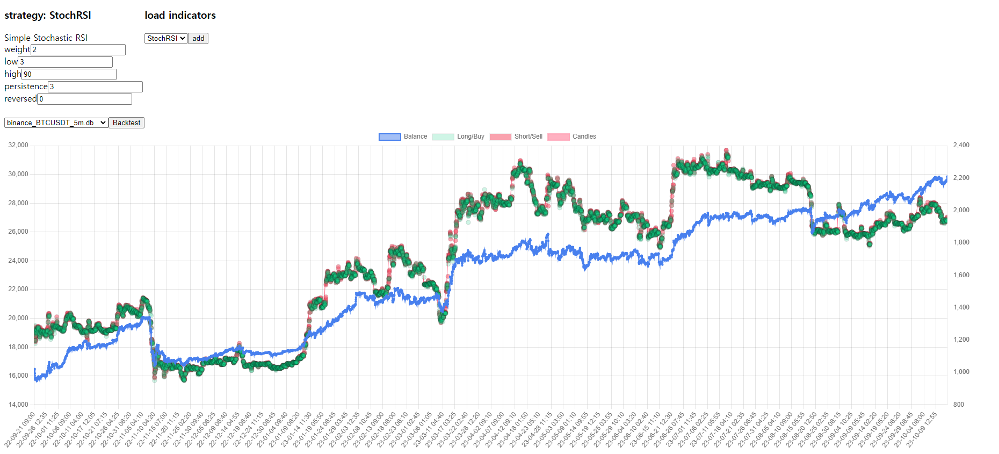
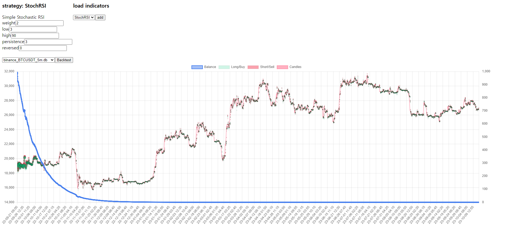

# retsuko

stock/crypto strategy backtesting framework
inspired from [gekko](https://github.com/askmike/gekko), which is not maintained, rewrited many things

## todo

- [x] fetching data
- [x] add strategy/indicator
- [x] backtesting
  - [ ] automatic backtesting with reports
- [ ] live paper trading
- [ ] live trading

## Backtesting Strategy Example

strategy backtesting, StochRSI without fee

with 0.4% fee

BOOM!